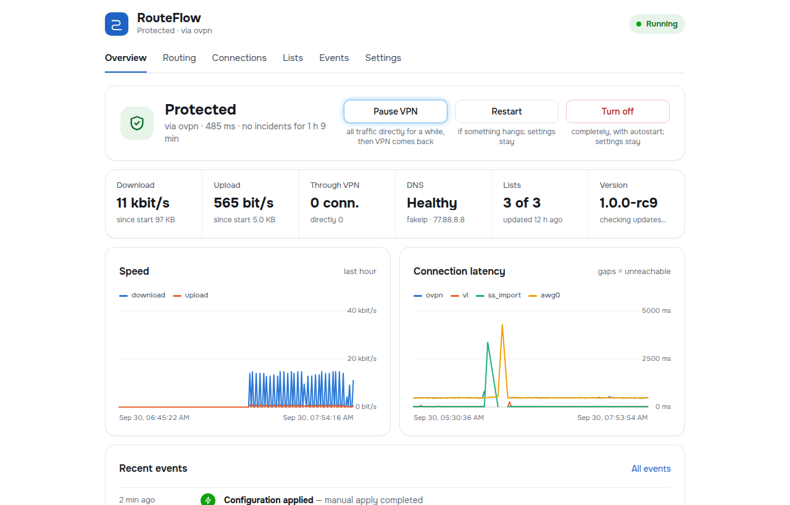
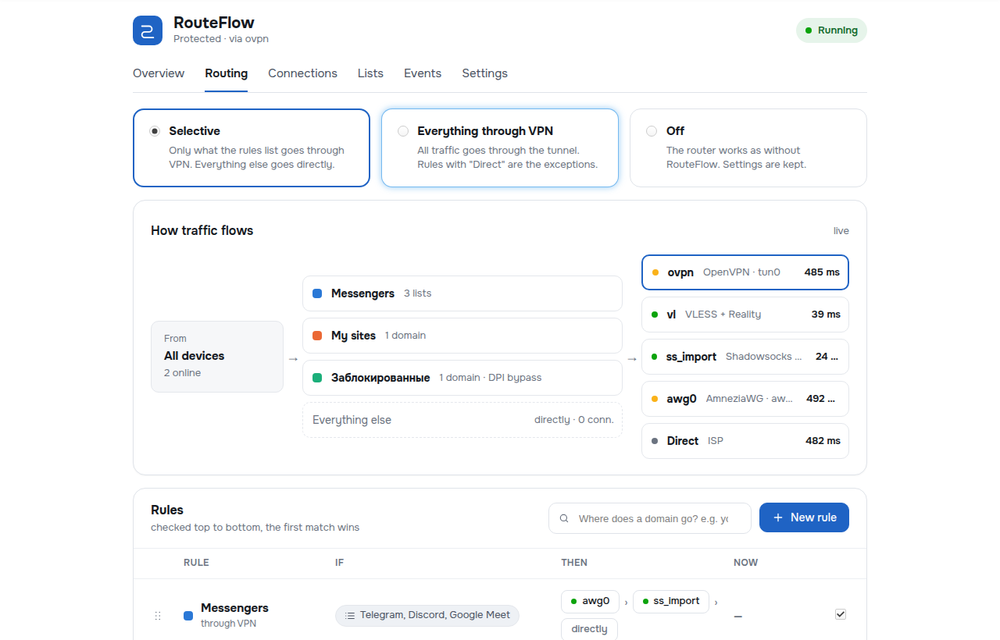
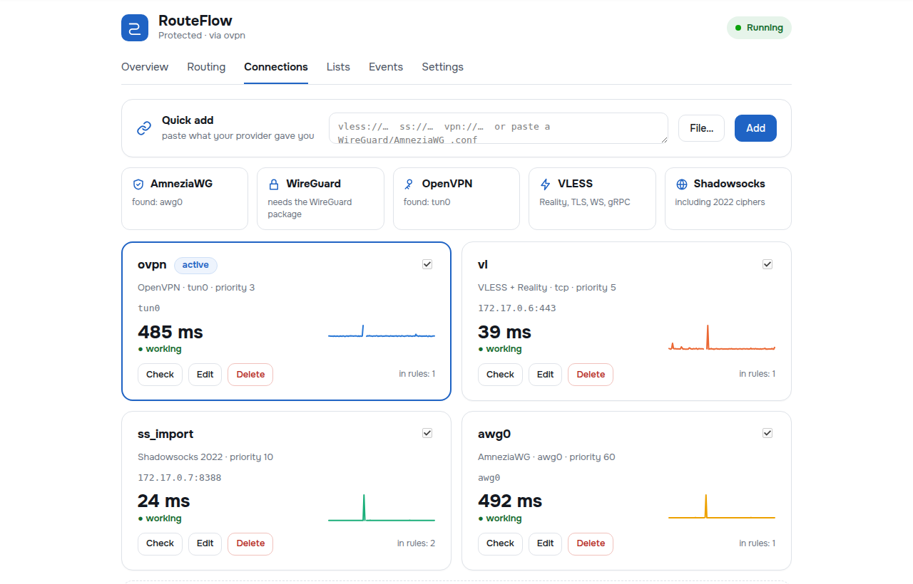
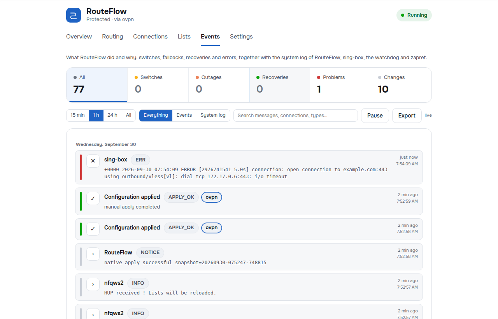
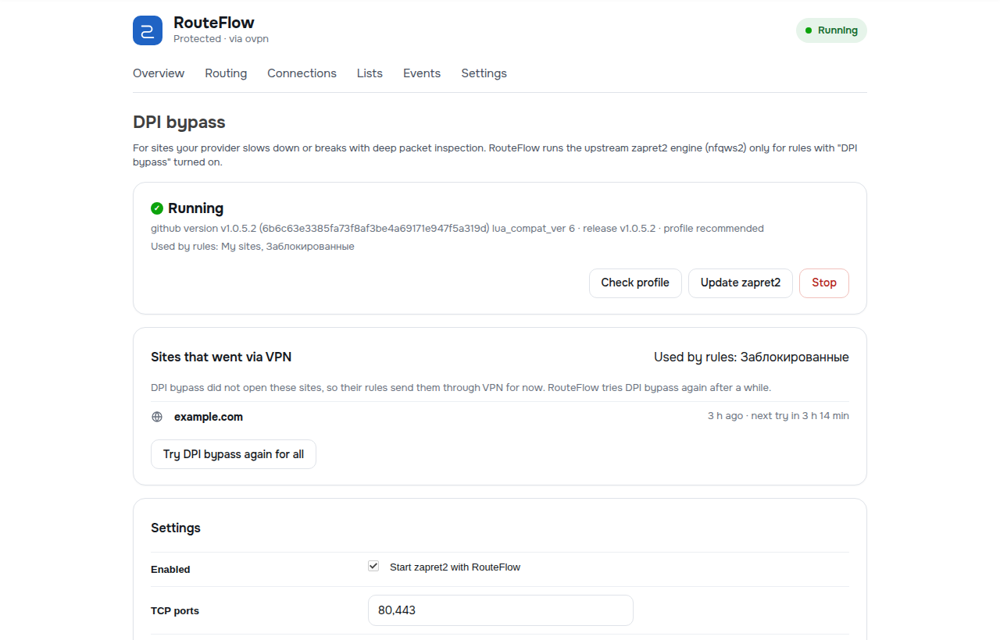

# RouteFlow for OpenWrt

**[Русская версия](README.ru.md)**

Signed release packages of **RouteFlow** and a one-line installer.

RouteFlow adds selective routing to an OpenWrt router: sites from your rules go through a VPN or proxy, everything else goes directly through your ISP. If a connection fails, RouteFlow switches to the next one and comes back when it works again. For sites your ISP breaks with DPI there is DPI bypass (zapret2), including "DPI bypass, VPN where it fails". Everything is managed from a modern LuCI app in English or Russian.



## Features

- **Rules** by site lists (25 ready community lists or your own by URL), domains, subnets, devices and ports. Rules are checked top to bottom; an exception for one domain is one click away.
- **Per rule:** through a VPN chain, DPI bypass with VPN where it fails, directly, or block.
- **Connections:** VLESS (Reality, TLS, WebSocket, gRPC, HTTPUpgrade), Shadowsocks (including 2022), AmneziaWG and WireGuard (paste a `.conf` or an AmneziaVPN `vpn://` link), OpenVPN. Several tunnels at once.
- **Failover and return** inside each rule's chain. When everything is down: go directly, block the rules' sites, or kill switch — also right after boot.
- **Safe by design:** every change is checked with `sing-box check` and rolled back on error; the last working setup is restored at boot; a watchdog; DNS and routing are handed back exactly as they were when RouteFlow is turned off or removed.
- **Works next to Podkop:** installing breaks nothing, switching is explicit and reversible, settings can be imported.
- **Pause VPN** for 5 min / 30 min / 2 h, a readable event log with filters, speed and latency charts, diagnostics and a support report without passwords.
- **Signed updates** in one click from this repository.

| Routing | Connections |
|---|---|
|  |  |
| **Events** | **DPI bypass** |
|  |  |

## Requirements

| | |
|---|---|
| Firmware | OpenWrt **24.10.x** (opkg). OpenWrt 25+ (apk) is not supported yet. |
| Architecture | Any: aarch64 (MediaTek Filogic MT7981/MT7986, e.g. Routerich AX3000; Qualcomm IPQ807x), arm (IPQ40xx), mipsel (MT7621), x86_64 and others. Dependencies come from your firmware's own feed. |
| Flash | ~20–35 MB free on overlay (`df -h /overlay`). RouteFlow itself is ~300 KB; most of it is `sing-box-tiny`. |
| RAM | 128 MB minimum, 256 MB recommended. |

## Install

Over SSH as `root`:

```sh
wget -qO- https://raw.githubusercontent.com/ConverPRO/routeflow-releases/main/install.sh | sh
```

What happens:
1. the release manifest is verified with the RouteFlow signing key (`usign`), then the installer, `SHA256SUMS` and every package;
2. conflicts are checked (passwall, openclash, homeproxy stop the install; for Podkop you are asked what to do — keeping it working is the default);
3. packages and dependencies are installed from your firmware's feed, with the compact `sing-box-tiny` if no sing-box is installed;
4. the configuration is validated.

**Networking and DNS are not changed and RouteFlow stays off.** Open **LuCI → RouteFlow** and complete the Setup Wizard (5 steps; nothing changes on the router before the last one). Keep an SSH session open during the first turn-on.

Options (before `sh`, e.g. `… | ROUTEFLOW_TAG=v1.0.0-rc9 sh`):

| Variable | Meaning |
|---|---|
| `ROUTEFLOW_TAG` | a specific release, e.g. `v1.0.0-rc9` |
| `ROUTEFLOW_CHANNEL` | `stable` or `rc` (release candidates); default: the latest stable, or the newest if there is none |
| `ROUTEFLOW_SINGBOX=full` | full sing-box instead of `sing-box-tiny` |
| `ROUTEFLOW_PODKOP` | `keep` (default), `remove` or `cancel` when Podkop is found |

### Manual install

Download `routeflow_*.ipk`, `luci-app-routeflow_*.ipk`, `routeflow-zapret_*.ipk`, `install.sh`, `preflight-standalone.sh` and `SHA256SUMS` from the [latest release](https://github.com/ConverPRO/routeflow-releases/releases), copy them into one directory on the router and run `sha256sum -c SHA256SUMS && sh install.sh` there.

## Update, turn off, remove

- **Update:** LuCI → RouteFlow → Settings → Maintenance → *Check for updates* → *Update now*, or `routeflowctl update-apply`. Settings are kept and migrated; a failed update rolls back.
- **Turn off:** Overview → *Turn off*, or `routeflowctl disable` — the router works exactly as without RouteFlow, settings are kept.
- **Remove:** `opkg remove luci-app-routeflow routeflow-zapret routeflow` — DNS and routing are restored first.

## FAQ

**Will installing it break my internet?**
No. The installer does not touch networking, DNS or the firewall, and RouteFlow stays off until you finish the Setup Wizard. The wizard validates the configuration before turning anything on.

**What if something goes wrong after turning it on?**
Run `routeflowctl disable` over SSH (or press *Turn off*): the router returns to exactly how it was. RouteFlow also protects itself: a change that does not start is rolled back automatically, and a broken configuration at boot is replaced by the last working one.

**I use Podkop. Do I have to remove it?**
No. Installing RouteFlow keeps Podkop working. RouteFlow will not start next to a running Podkop; when you turn RouteFlow on it asks to stop Podkop (it stays installed), and turning RouteFlow off starts Podkop again. The wizard can import Podkop's connections, lists and domains.

**Which VPN/proxy can I use?**
VLESS (Reality, TLS, WS, gRPC, HTTPUpgrade), Shadowsocks incl. 2022, AmneziaWG, WireGuard, OpenVPN. Paste a `vless://` / `ss://` link, a `.conf` or an AmneziaVPN `vpn://` link. AmneziaWG/WireGuard need their OpenWrt packages for your exact firmware (for AmneziaWG e.g. from [awg-openwrt](https://github.com/Slava-Shchipunov/awg-openwrt)).

**What happens when the VPN goes down?**
Each rule switches to the next connection in its chain and returns to the first one once it works. When every connection is down you choose: sites go directly (default), the rules' sites are blocked, or the whole internet is cut off (kill switch).

**Does it work against DPI blocking?**
Yes, with zapret2 (installed from the DPI bypass page with one click, for your router's architecture). A rule can use "DPI bypass, else VPN": sites open directly with DPI bypass, and a site that still fails goes through VPN automatically within seconds. Throttled (slowed, not blocked) sites are better sent "Through VPN".

**Can a site leak past the VPN over IPv6 or the browser's own DNS?**
Not for rule sites: by default RouteFlow steers IPv4 and refuses LAN IPv6 to the internet while it runs, so devices fall back to IPv4 immediately; browsers with their own DNS are matched by the TLS server name.

**Will it wear out the router's flash?**
No. Event logs, charts, exports and reports live in RAM with fixed limits; flash is written only on configuration changes, daily list updates and a clean shutdown.

**Is the download safe?**
Every release is signed. The installer and the router's update manager verify the signature with the public key below and every file's SHA-256 before installing; a release with a foreign signature is refused.

**Where do I report a problem?**
Open an [issue](https://github.com/ConverPRO/routeflow-releases/issues) and attach the report from **Diagnostics → Report for support** — it contains logs and settings with passwords and keys removed.

## Release signing key

```
untrusted comment: RouteFlow release signing key
RWSedSS5dcQhoekrOiS4aykFkJHUh9oVg4pYqbRYBb8XsGPCY3A8DXX6
```
