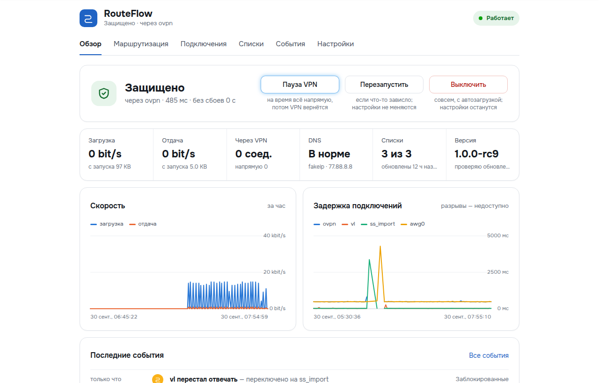
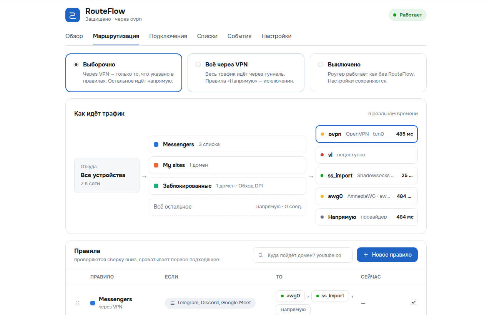
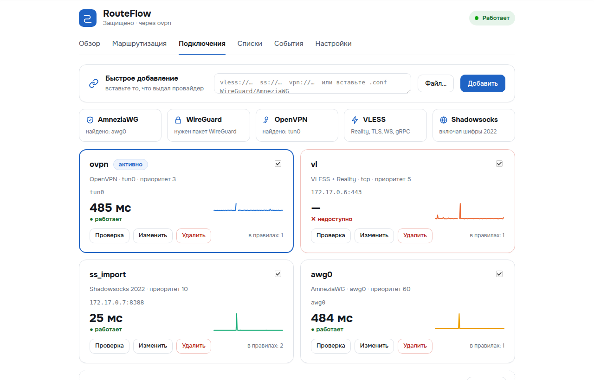
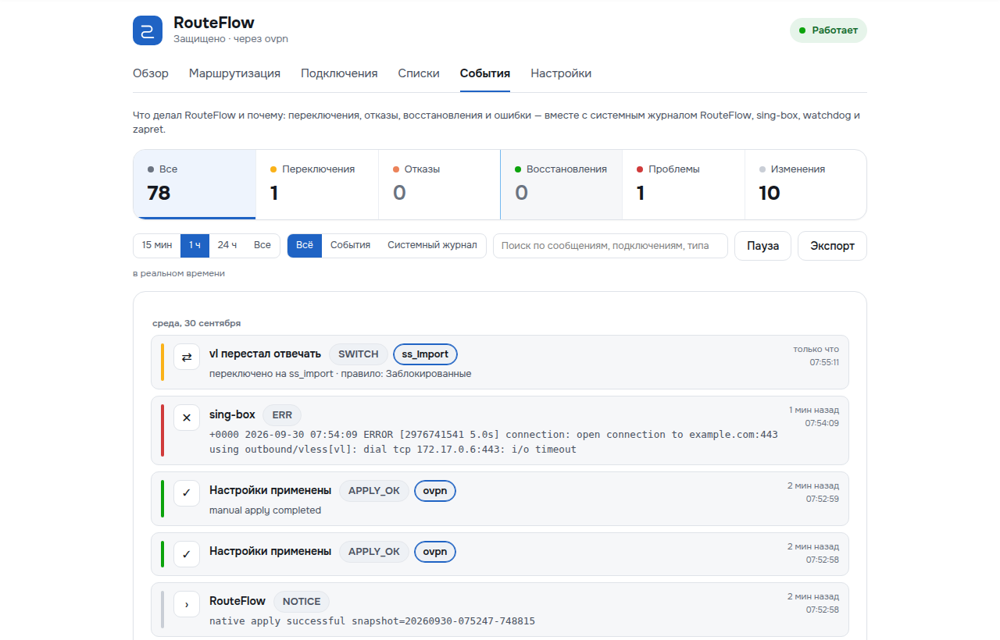
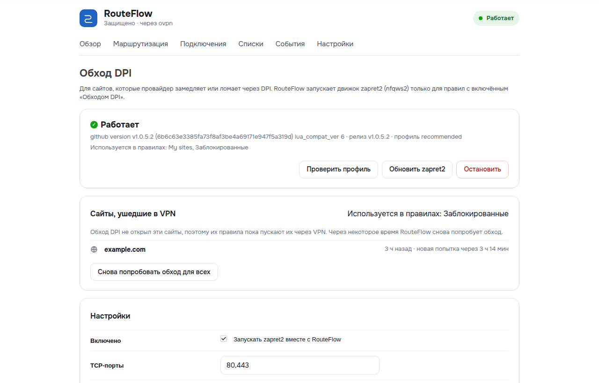

# RouteFlow для OpenWrt

**[English version](README.md)**

Подписанные пакеты **RouteFlow** и установщик в одну команду.

RouteFlow добавляет роутеру на OpenWrt выборочную маршрутизацию: сайты из ваших правил идут через VPN или прокси, всё остальное — напрямую через провайдера. Если подключение падает, RouteFlow переключается на следующее и возвращается, когда оно снова работает. Для сайтов, которые провайдер ломает через DPI, есть обход DPI (zapret2), в том числе «обход DPI, а где не помогает — VPN». Управление — современный веб-интерфейс LuCI на русском или английском.



## Возможности

- **Правила** по спискам сайтов (25 готовых списков сообщества или свои по ссылке), доменам, подсетям, устройствам и портам. Правила проверяются сверху вниз; исключение для одного домена — в один клик.
- **Для каждого правила:** через цепочку VPN, обход DPI с запасным VPN, напрямую или блокировать.
- **Подключения:** VLESS (Reality, TLS, WebSocket, gRPC, HTTPUpgrade), Shadowsocks (включая 2022), AmneziaWG и WireGuard (вставьте `.conf` или ссылку `vpn://` из AmneziaVPN), OpenVPN. Несколько туннелей одновременно.
- **Переключение и возврат** внутри цепочки каждого правила. Если упало всё: пускать напрямую, блокировать сайты правил или kill switch — в том числе сразу после загрузки.
- **Безопасность:** каждое изменение проверяется `sing-box check` и откатывается при ошибке; при загрузке восстанавливается последний рабочий конфиг; watchdog; при выключении или удалении DNS и маршрутизация возвращаются ровно такими, какими были.
- **Работает рядом с Podkop:** установка ничего не ломает, переход явный и обратимый, настройки можно импортировать.
- **Пауза VPN** на 5 мин / 30 мин / 2 ч, понятный журнал событий с фильтрами, графики скорости и задержек, диагностика и отчёт для поддержки без паролей.
- **Подписанные обновления** в один клик из этого репозитория.

| Маршрутизация | Подключения |
|---|---|
|  |  |
| **События** | **Обход DPI** |
|  |  |

## Требования

| | |
|---|---|
| Прошивка | OpenWrt **24.10.x** (opkg). OpenWrt 25+ (apk) пока не поддерживается. |
| Архитектура | Любая: aarch64 (MediaTek Filogic MT7981/MT7986, например Routerich AX3000; Qualcomm IPQ807x), arm (IPQ40xx), mipsel (MT7621), x86_64 и другие. Зависимости ставятся из фида вашей прошивки. |
| Флеш | ~20–35 МБ свободного места на overlay (`df -h /overlay`). Сам RouteFlow ~300 КБ, основное — `sing-box-tiny`. |
| ОЗУ | Минимум 128 МБ, рекомендуется 256 МБ. |

## Установка

По SSH под `root`:

```sh
wget -qO- https://raw.githubusercontent.com/ConverPRO/routeflow-releases/main/install.sh | sh
```

Что происходит:
1. манифест релиза проверяется ключом подписи RouteFlow (`usign`), затем установщик, `SHA256SUMS` и каждый пакет;
2. проверяются конфликты (passwall, openclash, homeproxy останавливают установку; про Podkop установщик спросит, что делать — по умолчанию он остаётся работать);
3. пакеты и зависимости ставятся из фида вашей прошивки; если sing-box нет — ставится компактный `sing-box-tiny`;
4. конфигурация проходит проверку.

**Сеть и DNS не меняются, RouteFlow остаётся выключенным.** Откройте **LuCI → RouteFlow** и пройдите мастер настройки (5 шагов; до последнего на роутере ничего не меняется). Первое включение делайте с открытой SSH-сессией.

Параметры (перед `sh`, например `… | ROUTEFLOW_TAG=v1.0.0-rc10 sh`):

| Переменная | Что делает |
|---|---|
| `ROUTEFLOW_TAG` | конкретный релиз, например `v1.0.0-rc10` |
| `ROUTEFLOW_CHANNEL` | `stable` или `rc` (релиз-кандидаты); по умолчанию последний стабильный, а если его нет — самый свежий |
| `ROUTEFLOW_SINGBOX=full` | полная сборка sing-box вместо `sing-box-tiny` |
| `ROUTEFLOW_PODKOP` | `keep` (по умолчанию), `remove` или `cancel`, если найден Podkop |

### Ручная установка

Скачайте из [последнего релиза](https://github.com/ConverPRO/routeflow-releases/releases) `routeflow_*.ipk`, `luci-app-routeflow_*.ipk`, `routeflow-zapret_*.ipk`, `install.sh`, `preflight-standalone.sh` и `SHA256SUMS`, положите в одну папку на роутере и выполните там `sha256sum -c SHA256SUMS && sh install.sh`.

## Обновление, выключение, удаление

- **Обновление:** LuCI → RouteFlow → Настройки → Обслуживание → *Проверить обновления* → *Обновить сейчас* или `routeflowctl update-apply`. Настройки сохраняются и переносятся; при ошибке обновление откатывается.
- **Выключение:** Обзор → *Выключить* или `routeflowctl disable` — роутер работает ровно как без RouteFlow, настройки сохраняются.
- **Удаление:** `opkg remove luci-app-routeflow routeflow-zapret routeflow` — сначала возвращаются DNS и маршрутизация.

## Вопросы и ответы

**Установка не сломает интернет?**
Нет. Установщик не трогает сеть, DNS и файрвол, а RouteFlow остаётся выключенным, пока вы не пройдёте мастер. Мастер проверяет конфигурацию, прежде чем что-то включить.

**Что делать, если после включения что-то пошло не так?**
Выполните по SSH `routeflowctl disable` (или нажмите *Выключить*): роутер вернётся ровно к прежнему состоянию. RouteFlow и сам себя страхует: изменение, которое не запустилось, откатывается автоматически, а сломанная конфигурация при загрузке заменяется последней рабочей.

**У меня Podkop. Его нужно удалять?**
Нет. Установка RouteFlow не мешает Podkop работать. RouteFlow не запускается рядом с работающим Podkop: при включении он спросит, остановить ли Podkop (тот останется установленным), а при выключении RouteFlow Podkop запустится снова. Мастер умеет импортировать подключения, списки и домены Podkop.

**Какие VPN и прокси поддерживаются?**
VLESS (Reality, TLS, WS, gRPC, HTTPUpgrade), Shadowsocks включая 2022, AmneziaWG, WireGuard, OpenVPN. Вставьте ссылку `vless://` / `ss://`, файл `.conf` или ссылку `vpn://` из AmneziaVPN. Для AmneziaWG и WireGuard нужны их пакеты OpenWrt под вашу прошивку (для AmneziaWG, например, из [awg-openwrt](https://github.com/Slava-Shchipunov/awg-openwrt)).

**Что будет, если VPN упадёт?**
Каждое правило переключится на следующее подключение своей цепочки и вернётся на первое, когда оно заработает. Если недоступно всё, выбираете сами: сайты идут напрямую (по умолчанию), сайты правил блокируются или отключается весь интернет (kill switch).

**Помогает ли от блокировок через DPI?**
Да, через zapret2 (ставится со страницы «Обход DPI» одной кнопкой под архитектуру роутера). Правило может работать в режиме «Обход DPI, иначе VPN»: сайты открываются напрямую с обходом, а сайт, который так не открылся, через несколько секунд сам уходит в VPN. Сайты, которые провайдер замедляет, а не блокирует, лучше сразу пускать «Через VPN».

**Может ли сайт утечь мимо VPN через IPv6 или DNS браузера?**
Для сайтов из правил — нет: по умолчанию RouteFlow управляет IPv4 и, пока он работает, не пропускает IPv6 из локальной сети в интернет, поэтому устройства сразу переходят на IPv4; браузеры со своим DNS распознаются по имени сервера в TLS.

**Не износит ли он флеш роутера?**
Нет. Журналы событий, графики, экспорты и отчёты хранятся в оперативной памяти с фиксированными пределами; на флеш пишется только при изменении настроек, ежедневном обновлении списков и штатном выключении.

**Безопасно ли скачивать?**
Каждый релиз подписан. Установщик и менеджер обновлений на роутере проверяют подпись ключом ниже и SHA-256 каждого файла до установки; релиз с чужой подписью отклоняется.

**Куда сообщить о проблеме?**
Создайте [issue](https://github.com/ConverPRO/routeflow-releases/issues) и приложите отчёт из **Диагностика → Отчёт для поддержки** — в нём журналы и настройки без паролей и ключей.

## Ключ подписи релизов

```
untrusted comment: RouteFlow release signing key
RWSedSS5dcQhoekrOiS4aykFkJHUh9oVg4pYqbRYBb8XsGPCY3A8DXX6
```
